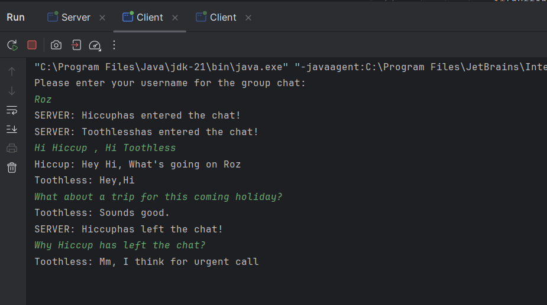

# Socket Hive 🗨️📲
**Socket Hive** is a simple backend project that demonstrates the implementation of a group chat application using socket programming in Java. The application allows multiple clients to connect and communicate with each other in real time. 

## Features ✨
- **Real-Time Communication**: Clients can send and receive messages instantly.
- **Multi-Client Support**: Multiple clients can connect to the server and participate in the group chat simultaneously.,Text-Based Backend

## Technologies Used 📌
- **Java**
- **Socket Programming**: For real-time client-server communication.

## How It Works 🗺️
1. A server is initialized to handle client connections and manage message broadcasting.
2. Clients can connect to the server using their respective socket connections.
3. Messages sent by one client are broadcast to all connected clients through the server.

## Prerequisites 📙
- **Java Development Kit (JDK)** installed on your system.
- Basic understanding of socket programming.

## Setup Instructions 🔨
1. Clone the repository or download the source code.
2. Compile the Java files:
   ```bash
   javac Server.java Client.java

3. Start the server:
    ```bash
    java Server
4. Run the client instances (in separate terminals or systems):
   ```bash
   java Client
5.Begin the group chat by sending messages from one client to see them reflected across others.



## Copyright
© 2025 SocketHive. All rights reserved.
